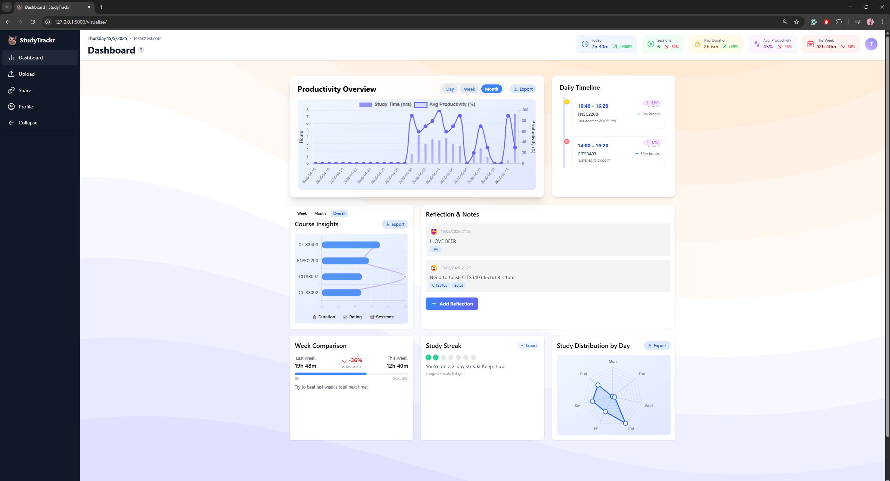
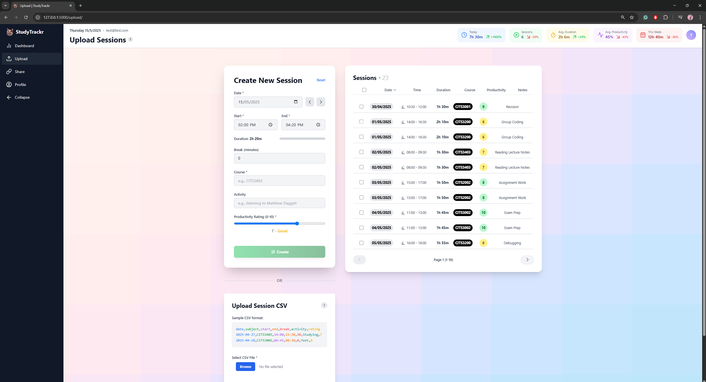
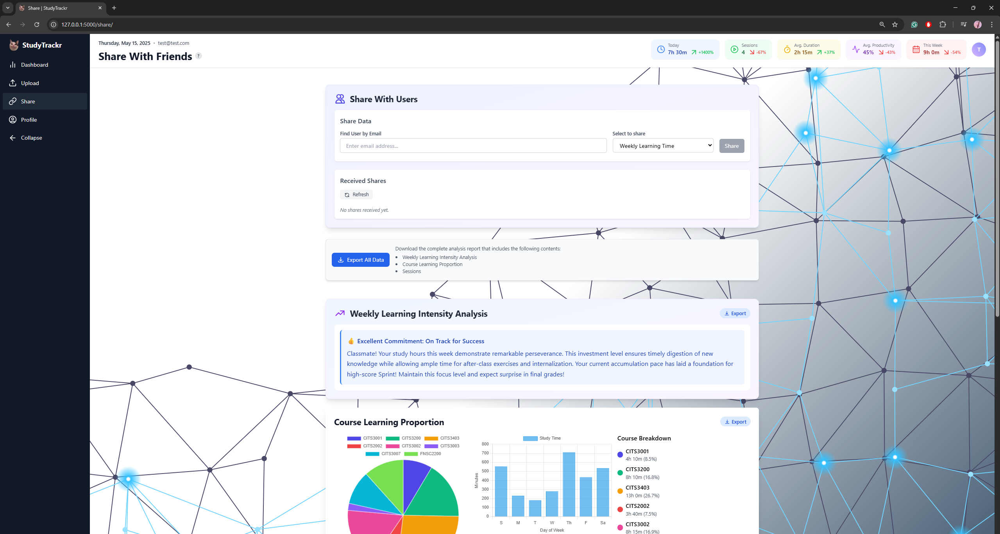
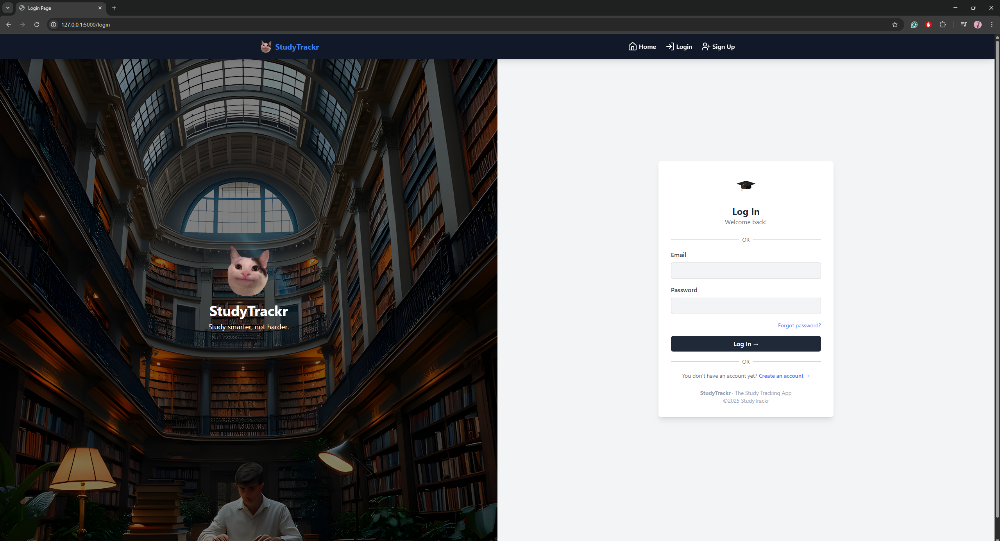
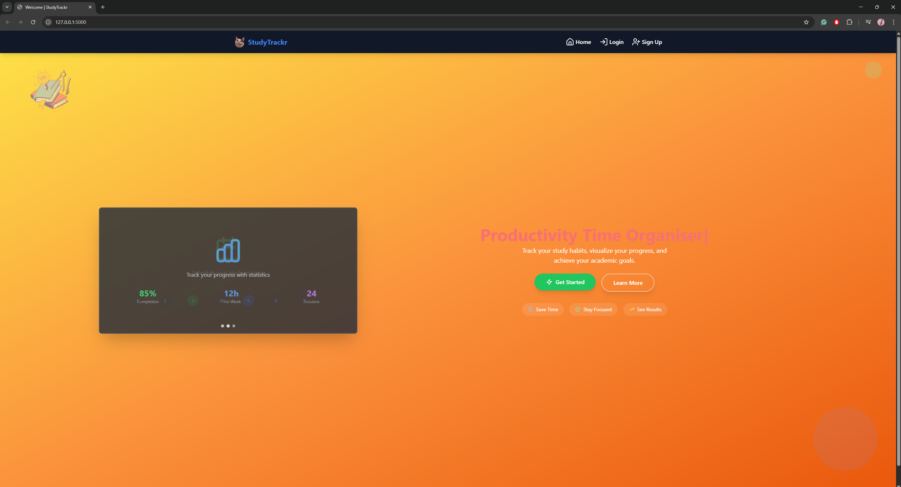
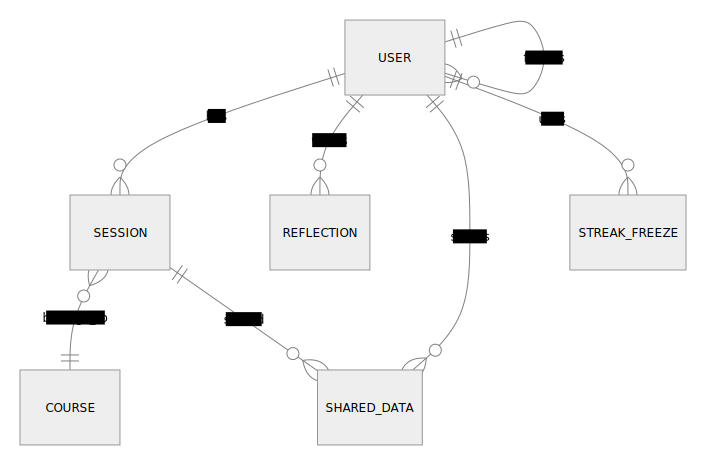

<!-- Banner/Logo -->
<p align="center">
  
</p>

# StudyTrackr

<p align="center">
  <b>Track, analyse, and improve your study habits. Built for students, by students.</b>
</p>

<!-- Badges -->
<p align="center">
  
  
  
</p>

---

## Table of Contents

<details>
<summary>Click to expand</summary>

- [StudyTrackr](#studytrackr)
  - [Table of Contents](#table-of-contents)
  - [Overview](#overview)
  - [Screenshots \& Demo](#screenshots--demo)
    - [Dashboard](#dashboard)
    - [Upload Sessions](#upload-sessions)
    - [Share Progress](#share-progress)
    - [Login](#login)
    - [Home](#home)
  - [Feature Highlights](#feature-highlights)
  - [Quick Start (60 Seconds)](#quick-start-60-seconds)
  - [System Architecture](#system-architecture)
  - [Database Schema](#database-schema)
    - [**User Table**](#user-table)
    - [**Session Table**](#session-table)
    - [**Reflection Table**](#reflection-table)
    - [**SharedData Table**](#shareddata-table)
    - [**StreakFreeze Table**](#streakfreeze-table)
    - [**Friends Table** (association table for User ↔ User)](#friends-table-association-table-for-user--user)
  - [Setup \& Installation](#setup--installation)
  - [Testing](#testing)
    - [1. Set Up the Test Environment](#1-set-up-the-test-environment)
    - [2. Run Unit Tests](#2-run-unit-tests)
    - [3. Run Selenium (End-to-End) Tests](#3-run-selenium-end-to-end-tests)
  - [Usage Examples](#usage-examples)
    - [1. Uploading Study Sessions](#1-uploading-study-sessions)
    - [2. Viewing Analytics](#2-viewing-analytics)
    - [3. Sharing Progress](#3-sharing-progress)
  - [FAQ](#faq)
  - [Contact \& Support](#contact--support)
  - [License](#license)
  - [References \& AI Use](#references--ai-use)
</details>

---

## Overview

**StudyTrackr** is a web app for university students to log, visualise, and share their study sessions.  
It helps you build better study habits, track productivity, and collaborate with friends—all in a modern, intuitive interface.

---

## Screenshots & Demo

### Dashboard
<p align="center">
  
</p>

### Upload Sessions
<p align="center">
  
</p>

### Share Progress
<p align="center">
  
</p>

### Login
<p align="center">
  
</p>

### Home
<p align="center">
  
</p>

---

## Feature Highlights

- 📥 **Manual & CSV Upload:** Log sessions one-by-one or import in bulk.
- 📊 **Automated Analytics:** Visualise trends, subject focus, and productivity.
- 🖼️ **Interactive Charts:** Bar, pie, and scatter plots (Chart.js).
- 🔥 **Study Streaks & Leaderboards:** Motivate yourself and compete with friends.
- 🤝 **Data Sharing:** Share stats via QR code or links.
- 📝 **Reflections:** Add notes and moods to your sessions.
- 📄 **PDF Export:** Download personalised study reports.
- 📱 **Responsive UI:** Works on all devices.

---

## Quick Start (60 Seconds)

```bash
git clone https://github.com/marc-la/agile-web-group-85.git
cd agile-web-group-85
python -m venv venv
venv\Scripts\activate  # or source venv/bin/activate
pip install -r requirements.txt
flask db upgrade
flask run
```
Open [http://127.0.0.1:5000](http://127.0.0.1:5000) in your browser.

---

## System Architecture

<p align="center">
  
</p>

- **MVC Pattern:** Flask blueprints for auth, dashboard, sessions, and API.
- **AJAX & REST:** Dynamic updates for charts and sharing.
- **ORM:** SQLAlchemy with SQLite for all persistent data.

---

## Database Schema

<p align="center">
  
</p>

**Main Tables:**  
User, Session, Course, Reflection, SharedData, StreakFreeze, Friends

<details>
<summary>Click for schema details</summary>

### **User Table**

| Column         | Type             | Constraints                | Description                    |
|----------------|------------------|----------------------------|--------------------------------|
| id             | Integer          | Primary Key, Unique        | User ID                        |
| email          | String(150)      | Unique, Not Null           | User email address             |
| password       | String(200)      | Not Null                   | Hashed password                |
| google_id      | String(200)      | Unique, Nullable           | Google OAuth ID (optional)     |
| created_at     | DateTime         | Default=now                | Account creation timestamp     |

- **Relationships:**  
  - Has many [`Session`](app/models/session.py) (One-to-Many)
  - Has many [`Reflection`](app/models/reflection.py) (One-to-Many)
  - Many-to-many with other users as friends (self-referential)
  - Can send/receive [`SharedData`](app/models/shared_data.py)

### **Session Table**

| Column            | Type         | Constraints                | Description                      |
|-------------------|--------------|----------------------------|----------------------------------|
| session_id        | Integer      | Primary Key, Unique        | Session ID                       |
| user_id           | Integer      | Foreign Key (User.id)      | Owner of the session             |
| date              | Date         | Not Null                   | Date of the session              |
| start_time        | Time         | Not Null                   | Start time                       |
| end_time          | Time         | Not Null                   | End time                         |
| break_minutes     | Integer      | Nullable                   | Break duration in minutes        |
| course            | String(100)  | Not Null                   | Course name                      |
| productivity_rating| Integer     | Not Null                   | Productivity rating (0-10)       |
| notes             | String(500)  | Nullable                   | Notes about the session          |

- **Relationships:**  
  - Belongs to [`User`](app/models/user.py)
  - Can be shared via [`SharedData`](app/models/shared_data.py)

### **Reflection Table**

| Column     | Type         | Constraints                | Description                  |
|------------|--------------|----------------------------|------------------------------|
| id         | Integer      | Primary Key, Unique        | Reflection ID                |
| user_id    | Integer      | Foreign Key (User.id)      | Owner of the reflection      |
| content    | Text         | Not Null                   | Reflection content           |
| mood       | String(20)   | Nullable                   | Mood emoji or description    |
| tags       | String(100)  | Nullable                   | Comma-separated tags         |
| created_at | DateTime     | Default=now                | Timestamp                    |

### **SharedData Table**

| Column              | Type         | Constraints                        | Description                       |
|---------------------|--------------|------------------------------------|-----------------------------------|
| id                  | Integer      | Primary Key, Unique                | SharedData ID                     |
| session_id          | Integer      | Foreign Key (Session.session_id)   | Session being shared              |
| shared_with_user_id | Integer      | Foreign Key (User.id)              | Recipient user                    |
| shared_by_user_id   | Integer      | Foreign Key (User.id)              | Sender user                       |
| shared_content      | Integer      | Default=20                         | Shared value (e.g., minutes)      |
| shared_content3     | String(100)  | Default='YOU RECEIVE A SHARE'      | Description/message               |
| status              | Enum         | Default='pending'                  | Share status (pending/accepted)   |
| shared_on           | DateTime     | Default=now                        | Timestamp                         |

### **StreakFreeze Table**

| Column   | Type     | Constraints                | Description                  |
|----------|----------|----------------------------|------------------------------|
| id       | Integer  | Primary Key, Unique        | StreakFreeze ID              |
| user_id  | Integer  | Not Null                   | User who used the freeze     |
| month    | Integer  | Not Null                   | Month of freeze              |
| year     | Integer  | Not Null                   | Year of freeze               |
| used_on  | Date     | Not Null                   | Date freeze was used         |

### **Friends Table** (association table for User ↔ User)

| Column    | Type     | Constraints                | Description                  |
|-----------|----------|----------------------------|------------------------------|
| user_id   | Integer  | Foreign Key (User.id)      | User                         |
| friend_id | Integer  | Foreign Key (User.id)      | Friend                       |

</details>

---

## Setup & Installation

**Requirements:**  
- Python 3.9+  
- `git` and `pip`  
- (Optional) Visual Studio Code

<details>
<summary>Full Setup Instructions</summary>

1. **Clone the Repository**
    ```bash
    git clone https://github.com/marc-la/agile-web-group-85.git
    cd agile-web-group-85
    ```
2. **Create & Activate a Virtual Environment**
    ```bash
    python -m venv venv
    venv\Scripts\activate  # or source venv/bin/activate
    ```
3. **Install Dependencies**
    ```bash
    pip install -r requirements.txt
    ```
4. **Initialise the Database**
    ```bash
    python db_init.py         # Only run this once
    python create_tables.py   # Only run this once
    flask db upgrade          # Verify database is up to date
    ```
5. **Run the Application**
    ```bash
    flask run
    ```
</details>

## Testing

To run tests, follow these steps in the root directory.

<details>
<summary><strong>Show detailed testing instructions</strong></summary>

### 1. Set Up the Test Environment

- **Windows:**  
  ```bash
  set APP_TESTING=1
  ```
- **macOS/Linux:**  
  ```bash
  export APP_TESTING=1
  ```

> **Note:**  
> Setting `APP_TESTING=0` ensures the app uses the test database and disables email sending.  
> Remember to unset this variable after testing.

### 2. Run Unit Tests

```bash
python -m unittest discover -s app/tests/unit
```

### 3. Run Selenium (End-to-End) Tests

```bash
export APP_TESTING=0
pytest app/tests/selenium
```

</details>

---

## Usage Examples

### 1. Uploading Study Sessions

- Go to **Upload**.
- Fill out the form or upload a CSV.
- Click **Create** to add sessions.

### 2. Viewing Analytics

- Visit **Dashboard** for charts and insights.
- Filter by day, week, or course.

### 3. Sharing Progress

- Go to **Share**.
- Search for a friend to send data to.
- Target friend can then accept or view shared stats.

---

## FAQ

**Q: I can't log in or register.**  
A: Check your email and password. If you forgot your password, contact a group member.

**Q: CSV upload fails.**  
A: Ensure your CSV matches the sample format shown on the Upload page.

**Q: Charts aren't updating.**  
A: Try refreshing the page. If the problem persists, check your browser console for errors.

**Q: Selenium tests fail.**  
A: Make sure ChromeDriver or GeckoDriver is installed and on your PATH, and all dependencies are installed.

---

## Contact & Support

- **Group Members:**
  | UWA ID     | Name                   | GitHub Username   |
  |------------|------------------------|-------------------|
  | 23954936   | Jiabao Liu             | jiabaoliu-015     |
  | 23857377   | Marc Labouchardiere    | marc-la           |
  | 23706774   | Joshua Chin            | Jaecheonz         |

- For help, open an issue or email a group member.

---

## License

This project is for educational purposes only.  
© 2025 StudyTrackr Team

---

## References & AI Use

This project was developed with significant assistance from AI tools, including OpenAI's ChatGPT, GitHub Copilot, and other large language models. These tools were used for code generation, debugging, documentation, and architectural suggestions throughout the development of StudyTrackr.

**References:**
- OpenAI ChatGPT (https://chat.openai.com/)
- GitHub Copilot (https://github.com/features/copilot)
- Claude (Anthropic) (https://claude.ai/)
- Qwen3 (Alibaba Cloud) (https://qwen3.opencompass.org/)
- Deepseek (https://deepseek.com/)
- Flask Documentation (https://flask.palletsprojects.com/)
- SQLAlchemy Documentation (https://docs.sqlalchemy.org/)
- Chart.js Documentation (https://www.chartjs.org/docs/)
- Other resources as cited in code comments

All AI-generated content was reviewed and adapted by the project team to ensure correctness and suitability for educational purposes.